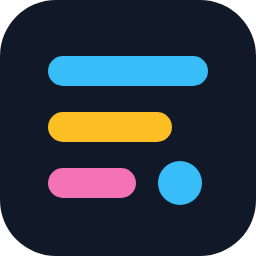
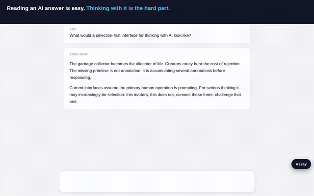
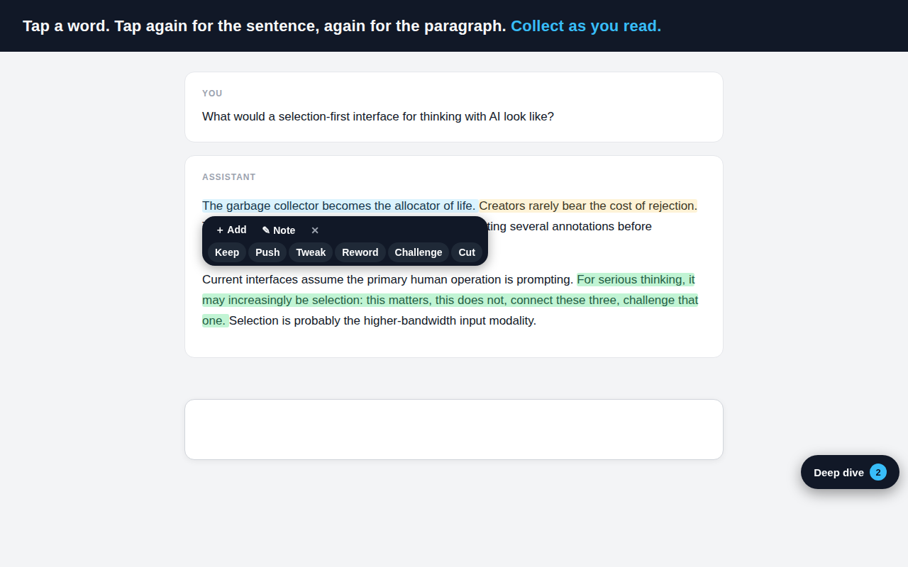
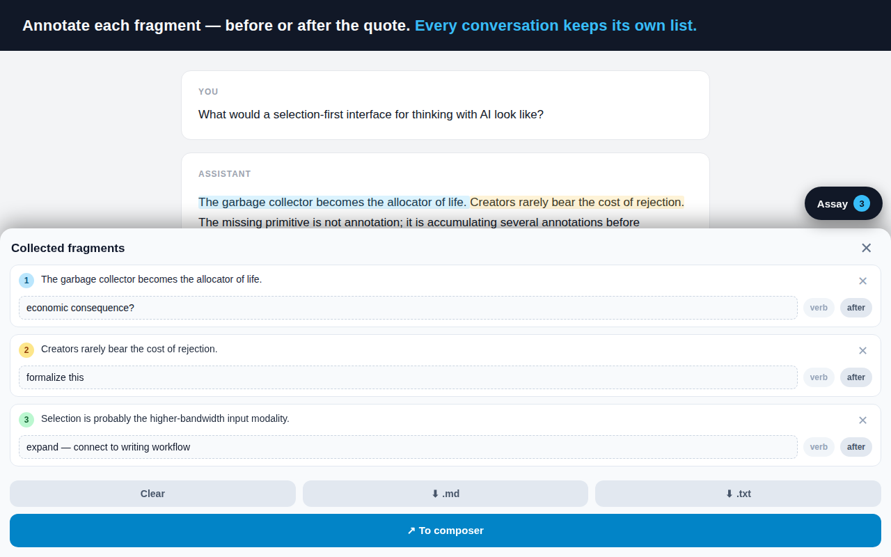
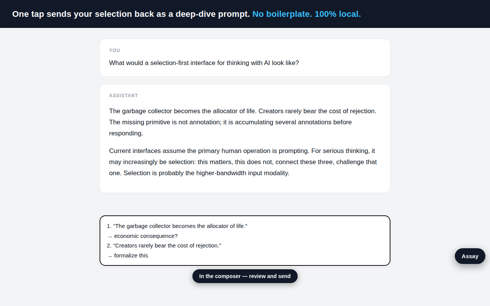

<p align="center">
  
</p>

<h1 align="center">Assay</h1>

<p align="center">
  <strong>Tap, collect and annotate passages in ChatGPT and Claude answers, then send them back as one deep-dive prompt.</strong><br>
  A browser extension and userscript for reading AI chats critically, built for the phone first.<br>
  100% local: no account, no server, no API keys, no tracking.
</p>

<p align="center">
  <a href="https://assay.projectnothing.ai">Website</a> ·
  <a href="https://assay.projectnothing.ai/install">Install on a phone</a> ·
  <a href="#install">Install</a> ·
  <a href="#how-it-works">How it works</a> ·
  <a href="#privacy">Privacy</a> ·
  <a href="#faq">FAQ</a> ·
  <a href="#development">Development</a>
</p>

<p align="center">
  <a href="LICENSE"></a>
  <a href="https://github.com/puj/Assay/releases/latest"></a>
  <a href="https://github.com/puj/Assay/actions/workflows/release.yml"></a>
  
  
  <!-- Once the store listings are live:
  <a href="https://addons.mozilla.org/firefox/addon/assay/"></a>
  <a href="https://chromewebstore.google.com/detail/EXTENSION_ID"></a>
  -->
</p>

<p align="center">
  <a href="marketing/assay-demo-landscape.mp4"></a><br>
  <sub>Tap a word → widen to the sentence → add a note → send the set back as one prompt.
  <a href="marketing/assay-demo-landscape.mp4">MP4</a> · <a href="marketing/assay-demo-vertical.mp4">phone-sized MP4</a></sub>
</p>

---

## What it does

Reading an AI answer is easy. Thinking with it is the hard part. Every chat
interface is built around one verb, *prompt*, but most of the real work is
editorial: reading a long reply and deciding which three sentences deserve a
second look. That step has no interface. It is copy, paste, retype, and on a
phone it is barely possible at all.

Assay gives that step an interface. While you read a reply on
[chatgpt.com](https://chatgpt.com) or [claude.ai](https://claude.ai):

- **Tap a word** in a reply and it highlights, with a small action bar.
- **Tap the highlight to widen it**: word → sentence → paragraph → back to the word.
- **Tap nearby words to grow the selection** toward them, across a paragraph break; tap further away and you start a new selection there.
- **＋ Add** collects the passage; **✎ Note** annotates it, before or after the quote, now or later.
- **A verb palette** for when typing is expensive: **Keep · Push · Tweak · Reword · Challenge · Cut**. One tap collects the passage classified; the verb becomes a plain-English clause in the prompt.
- **Six rotating highlight colours** so you can see what you already took, and they survive a page refresh.
- **A tray** holds everything you kept while the chat stays scrollable; a pill toggles it.
- **↗ To composer** writes your fragments and notes into the site's own message box. Nothing is auto-sent; you review, then send.
- **On GitHub**, where there is no message box, the same tray offers **⧉ Copy notes** instead: the set goes to the clipboard and stays in the tray.
- **⭳ .md / ⭳ .txt** export the *whole* conversation as Markdown or plain text with your fragments appended, named after the chat: `assay-<chat title>-<date>-<time>.md`.
- **Every conversation keeps its own list**, so a batch started in one thread never bleeds into another.

No wrapper prompt is added to what you send. Your selection is the signal and
your notes carry the intent, which is why replies to an Assay prompt tend to
be sharper than replies to "tell me more about the second point".

## Install

Assay is one file delivered three ways. All three share the same code and the
same local storage, so you can switch between them without losing anything.

| You are on | Do this |
| --- | --- |
| **Firefox for Android** (recommended on phones) | Install the userscript in [Tampermonkey](https://addons.mozilla.org/firefox/addon/tampermonkey/) or [Violentmonkey](https://addons.mozilla.org/firefox/addon/violentmonkey/): open **<https://assay.projectnothing.ai/assay.user.js>** and accept. It auto-updates. The step-by-step version is at [assay.projectnothing.ai/install](https://assay.projectnothing.ai/install). |
| **Firefox desktop** | Same userscript route, or the Firefox Add-ons listing once it clears review (link will appear here and on the site). |
| **Chrome, Edge, Brave (desktop)** | Chrome Web Store listing pending. Until then: download `assay-extension.zip` from the [latest release](https://github.com/puj/Assay/releases/latest), unzip it, open `chrome://extensions`, turn on *Developer mode*, choose *Load unpacked* and pick the folder. |
| **Chrome on Android, Safari, anything else** | The **bookmarklet**: open [assay.projectnothing.ai/install](https://assay.projectnothing.ai/install), add the bookmark it gives you, and tap it once per visit. Zero install, nothing to update. |

Works on `chatgpt.com`, `chat.openai.com`, `claude.ai` and `github.com`.
Firefox 121+ and any current Chromium browser.

## How it works

The interaction is a small grammar you can learn in a minute:

1. **Tap a word** in an assistant reply. It highlights; an action bar appears next to it.
2. **Tap the highlight** to cycle its scope: word → sentence → paragraph → word.
3. **Tap another word in the same reply** to grow the selection to include it, in either direction, and into the paragraph next to it. A tap further off than that is a different passage, so it starts a new selection there instead — reaching a distant paragraph is a tap at a time.
4. **Tap a different reply, empty space, or ✕** to start over. Long-press selection still works for arbitrary spans.

The same taps work inside the cards ChatGPT renders in the conversation — a canvas draft, a message swapped into an edit box. On a phone the caret is handed straight back, so the keyboard never opens over what you are reading. The only text Assay leaves alone is the composer: that is your draft, not a passage.
5. **＋ Add** collects it. **✎ Note** attaches a few words, placed *before* the quote (a lead-in) or *after* it (an instruction). Or tap a **verb** (Keep, Push, Tweak, Reword, Challenge, Cut) to collect it classified in one tap, no keyboard.
6. Open the **tray** to annotate later, set or change a verb, or remove a fragment (its highlight goes with it).
7. **↗ To composer** writes the set into the message box. **⭳ .md** or **⭳ .txt** saves the whole conversation locally instead.

What lands in the composer is plain text with no boilerplate, numbered only
when there is more than one fragment:

```
1. push this further:
“The garbage collector becomes the allocator of life.”

2. “Creators rarely bear the cost of rejection.”
→ formalize this
```

A verb or a *pre* note renders as a leading clause (`keep as is`, `push this
further`, `tweak this, keep the idea`, `reword this`, `challenge this`, `drop this`); a *post*
note renders as a `→` line after the quote. No legend is sent: the clauses
are ordinary English.

Under the hood, taps resolve to text with `caretPositionFromPoint` and
`Intl.Segmenter` (regex fallback), inside a virtual text axis per message so
selections can span blocks. Highlights are overlay rectangles from
`Range.getClientRects()`; the site's DOM is never mutated, so React
re-renders cannot break them. All UI lives in a shadow root and is
re-attached on in-app navigation. Note controls and the tray track
`visualViewport`, so the on-screen keyboard never covers them.

## Screenshots







## Privacy

- **No account, no server, no analytics, no API keys.** Your existing ChatGPT or Claude subscription does all the inference.
- **Nothing leaves your device** except the message you choose to send, through the site's own composer.
- Fragments and notes live in the site's `localStorage`, on your device, keyed per conversation. Highlights are re-found in the page after a refresh; nothing is written to the conversation itself.
- The extension makes **no network requests** and loads **no remote code**. It runs only on the three chat hosts above.
- The full policy is [`PRIVACY.md`](PRIVACY.md), published at <https://www.projectnothing.ai/assay/privacy>.

The Firefox manifest declares `data_collection_permissions: none`, and the
code is small enough to read in one sitting: [`src/assay.core.js`](src/assay.core.js).

## Why Assay and not…

- **…copy and paste?** On a phone, selecting three separate sentences from a long reply and quoting them back with notes is a five-minute job. With Assay it is a few taps, and the result is structured.
- **…the chat app's own "quote" reply?** That quotes one span, once. Assay collects many passages, across paragraphs, annotates each, keeps them per conversation, and exports the whole thread.
- **…a general web highlighter?** Those annotate pages for later reading. Assay's output is the *next prompt*: it closes the loop back into the conversation.
- **…a wrapper app with its own API key?** Assay adds nothing to the model and sends nothing anywhere. It is an editorial layer on the interface you already pay for.

## FAQ

**Does Assay work on a phone?**
Yes, that is what it was built for. Firefox for Android with Tampermonkey or Violentmonkey gives the full auto-loading experience; every other mobile browser can use the bookmarklet.

**Does it cost money or need an API key?**
No. It is free, open source, and uses your existing ChatGPT or Claude session. There is nothing to sign up for.

**Does it send my conversations anywhere?**
No. It has no backend and makes no network requests. The only thing that leaves your device is the message you review and send yourself.

**Which sites does it support?**
ChatGPT (`chatgpt.com`, `chat.openai.com`), Claude (`claude.ai`) and GitHub (`github.com`).

**What does it do on GitHub?**
The same thing, over a file instead of a reply: tap to collect passages from a file's rendered markdown or from its code lines, where each line is a paragraph and keeps its indentation. Every file keeps its own list, ⭳ .md exports the file with your fragments appended, and since there is no message box the primary action is ⧉ Copy notes.

**Where are my fragments stored?**
In the site's `localStorage` on that device, one list per conversation — or per file, on GitHub. Switching from the userscript to the store extension keeps them, since the storage belongs to the site, not the extension.

**Can I export a whole ChatGPT or Claude conversation to Markdown?**
Yes. ⭳ .md saves the visible conversation, roles, text and code blocks, with your fragments appended, as `assay-<chat title>-<date>-<time>.md`. ⭳ .txt does the same in plain text. Scroll to the top of very long threads first so everything is loaded.

**Does it auto-send anything?**
Never. ↗ To composer only fills the message box.

**Is it open source? Can I fork it?**
MIT licensed, so yes. A fork distributed to the public needs its own name and icon; see [License and trademark](#license-and-trademark).

**Why "Assay"?**
To assay is to test ore and say what in it is worth keeping. That is the whole job: read the reply, keep what deserves a second look.

## Development

Everything is generated from one source file; there is no bundler and no
runtime dependency.

| File | Purpose |
| --- | --- |
| `src/assay.core.js` | The single source of truth: all logic and UI. |
| `assay.user.js` | Generated: userscript header + core (Tampermonkey/Violentmonkey). |
| `extension/` | Generated content script + `manifest.json` (MV3, Chrome and Firefox). |
| `assay-extension.zip` | Generated, reproducible extension package for the stores. |
| `install.template.html` → `install.html` | Mobile install page; derives the bookmarklet from the embedded source. |
| `site/` | The public site at assay.projectnothing.ai, deployed as its own Vercel project (root `site`, no build step). |
| `store/` | Store listing copy, submission checklist, and listing images. |
| `marketing/` | Demo videos, video script, social posts. |
| `scripts/` | Playwright renderers for the icons, screenshots and demo video. |

```sh
node build.js        # regenerate assay.user.js, extension/, install.html, site/, the zip
npm run assets       # re-render icons, screenshots and promo tiles (needs playwright-core)
npm run video        # re-record the demo video
```

To hack on it, load `extension/` unpacked in a desktop browser, or paste
`assay.user.js` into Tampermonkey. `window.__assay._debug` exposes the tap
engine's internals in the console.

**Releases.** Every merge to `master` that touches the extension builds it,
creates a GitHub Release tagged `v<version>` with `assay-extension.zip`,
`assay.user.js` and `install.html` attached, and submits the zip to Firefox
Add-ons (and to the Chrome Web Store once those secrets exist). Bump
`VERSION` in `src/assay.core.js` for each release; stores reject duplicate
versions.

Issues and pull requests are welcome: <https://github.com/puj/Assay/issues>.

## Roadmap

- A **connect** verb that relates a fragment to earlier fragments, which
  needs the cross-conversation list below.
- A shared cross-conversation fragment list, and an archive across sessions.
- Editable payload templates.
- Claude selector hardening; store listings for one-tap installs.

## The experiment

Assay is a [Project Nothing](https://www.projectnothing.ai) experiment,
`exp-0030`. *This is an experiment. It might be gone next month.* The
contract is [EXPERIMENT.md](EXPERIMENT.md), the running record is
[LOG.md](LOG.md), and what happened to it is at
[projectnothing.ai/e/assay](https://www.projectnothing.ai/e/assay).

Assay is not affiliated with OpenAI or Anthropic.

## License and trademark

The code is released under the [MIT License](LICENSE). The **Assay** name,
the rows-and-dot mark, and the Project Nothing name are trademarks of
Project Nothing and are *not* covered by that license: you are free to fork,
modify and redistribute the code, but a fork distributed to the public must
use its own name and icon so users can tell it apart from the official
builds on the extension stores.
